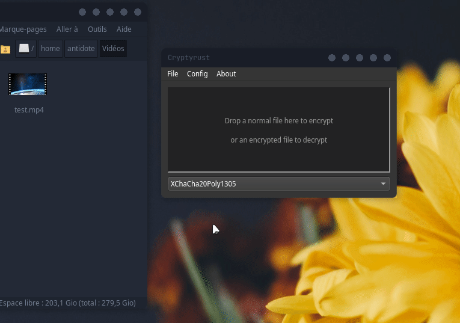

[](https://ci.appveyor.com/project/Antidote1911/dexiosgui/branch/master)
[](https://github.com/Antidote1911/dexiosgui/actions/workflows/ci.yml)
[](https://opensource.org/licenses/GPL-3.0)


# DexiosGui
**Simple cross-platform drag-and-drop Dexios file encryption.**<br/>
Latest Windows x64 release is [here](https://github.com/Antidote1911/cryptyrust/releases/latest).

DexiosGui is a Qt/C++ app for encrypt and decrypt files with the [Dexios format](https://github.com/brxken128/dexios) made by [ brxken128](https://github.com/brxken128).
It only encrypt and decrypt with the Dexios "stream mode". "Memory mode" is not yet implemented.  
This app is a work in progress made in 3 hours ! Sorry for english typo, comments ect... I don't have much time. It use modifications of my encryption tool [Cryptyrust](https://github.com/Antidote1911/cryptyrust) to use Dexios format.


The gif demo is Cryptyrust, but Dexiosgui is similar.

For informations about the encryption format, have a look to [Dexios Github](https://github.com/brxken128/dexios)

## Build Linux core instructions:
In the root folder build the dexioscore lib with `cargo build --release`

## Build Windows core instructions:

- Install [Visual Studio Build Tools 2019](https://visualstudio.microsoft.com/fr/thank-you-downloading-visual-studio/?sku=BuildTools&rel=16)  
- Make sure rust use msvc. Run in command line :
`rustup default stable-x86_64-pc-windows-msvc`
- Build rust CLI App and core project : `cargo build --release`

## C++ GUI Compilation instructions:
C++ GUI require Qt5 or Qt6 and dexioscore build with `cargo build --release`.
After building the Rust core with `cargo build --release`, Open qtgui/CMakeLists.txt with your IDE and build it. If You use qt creator, you can open project cryptyrust.pro to build it.


```bash
# With Linux command-line, open a terminal in qtgui folder
qmake dexiosgui.pro
make
```
```bash
# For Windows
cd qtgui
mkdir build
cd build
cmake -G "NMake Makefiles" -DCMAKE_BUILD_TYPE=Release ..
nmake
```
**Data Loss Disclaimer:**  
if you lose or forget your password, **your data cannot be recovered !**  
Use a password manager or another secure form of backup.<br/>
